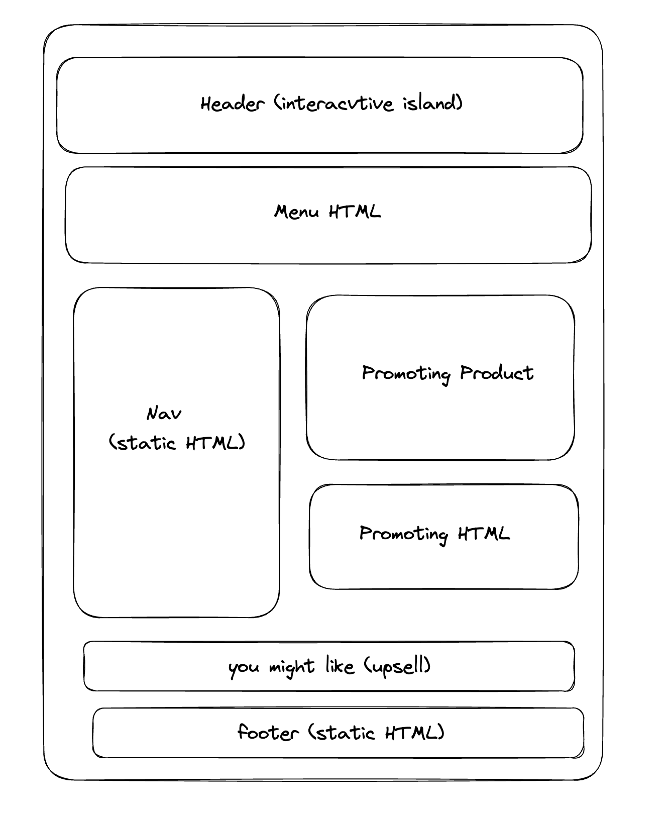

> I've often wished to compile a comprehensive comparison of various frameworks because I've found existing resources lacking in terms of practicality and relevance. Many benchmarks or blogs on this topic seem outdated, making it cumbersome to search for up-to-date information every time. Instead of relying on frequent Google searches, I've contemplated the idea of creating my own reference resource. 

> It takes time, I should be able to pull it off by the year of 2030. :smirk:

# Let's get started with architecture

## Island
### tl;dr:
Islands architecture promotes the creation of discrete, targeted interactive elements within server-rendered web pages. This approach gradually enhances the HTML output, providing greater precision in how enhancements are applied. Instead of relying on a single application to handle full-page rendering, islands introduce multiple entry points. These "islands" of interactivity can be separately delivered and activated, leaving the rest of the page as static HTML.

Excessive JavaScript loading and processing can have a detrimental impact on performance. However, even in predominantly static websites, a certain level of interactivity and JavaScript functionality is often necessary. To strike a balance between:

Achieving interactivity similar to Client-Side Rendered (CSR) applications.
Reaping the SEO benefits comparable to Server-Side Rendered (SSR) applications.
We've explored various forms of Static Rendering techniques. These techniques allow you to build applications that aim to find this equilibrium.

In SSR, the fundamental concept involves rendering HTML on the server and delivering it along with the necessary JavaScript to re-establish its functionality on the client-side. Rehydration, in this context, refers to the process of re-establishing the state of UI components on the client-side following their initial rendering on the server. Given that rehydration introduces some overhead, different variations of SSR focus on optimizing this process. They often achieve this through techniques like partial hydration of critical components or streaming components as they are rendered. However, the overall amount of JavaScript delivered to the client remains largely unchanged across these techniques.

The term "Islands architecture" was popularized by Katie Sylor-Miller and Jason Miller to describe a paradigm that seeks to minimize the amount of JavaScript sent to the client by using "islands" of interactivity. These islands can be independently delivered atop otherwise static HTML. This architectural approach is based on a component-based model that divides the page into distinct regions: static and dynamic islands. The static regions consist of non-interactive HTML that doesn't require rehydration. On the other hand, the dynamic regions comprise a combination of HTML and scripts capable of re-establishing their interactivity after initial rendering.

### Frameworks
* Astro

### More to know
* https://jasonformat.com/islands-architecture/
* https://docs.astro.build/en/concepts/islands/

## Progressive Hydration
### tl;dr:
In a server-rendered application, the server takes charge of generating the HTML for the current navigation. After successfully creating the HTML, which includes essential CSS styles and JSON data required for rendering the static user interface accurately, this data is transmitted to the client. Thanks to the server's role in markup generation, the client can efficiently parse this information and promptly display it on the screen, resulting in a rapid First Contentful Paint (FCP).

> Delay loading javascript for less important parts of the page

### Implementation

### Pros and Cons

### Frameworks